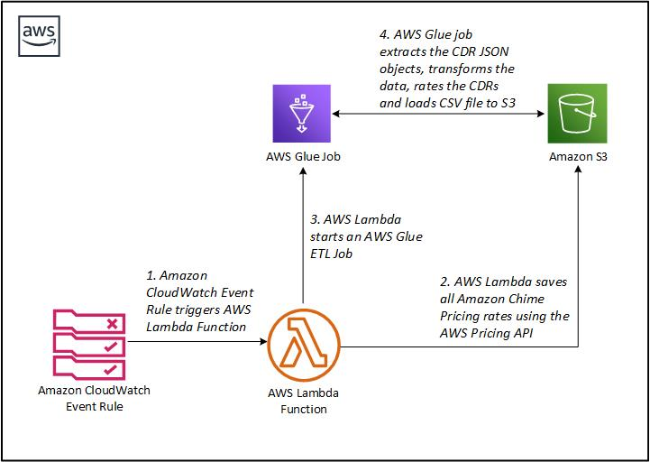
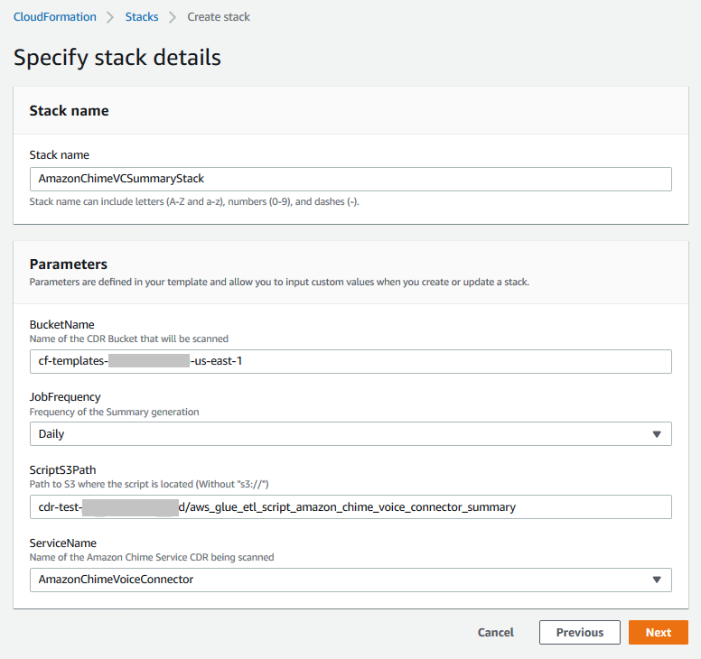
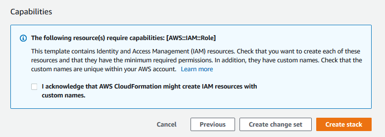
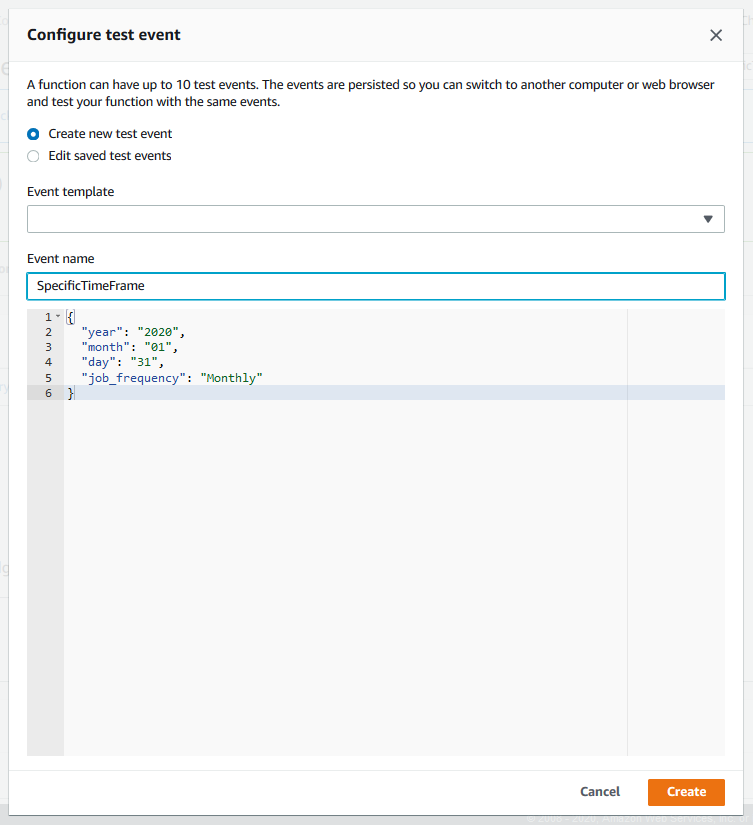
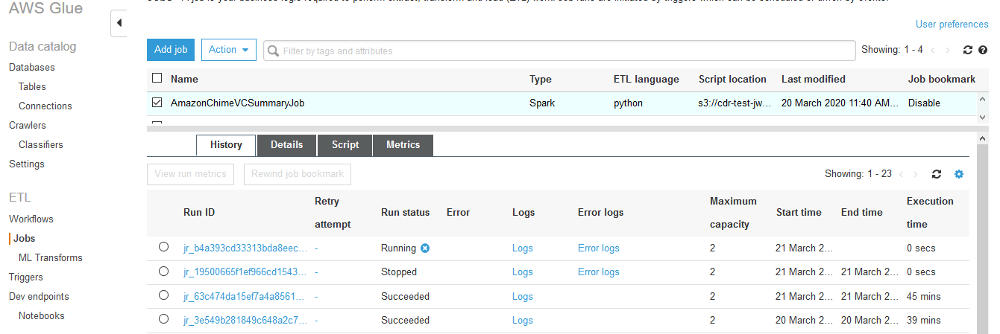

# Automating the Transformation and Rating of CDR JSON from Amazon Chime Voice Connector

## Table of Contents
1. [Project Overview](#Project-Overview)
2. [Architecture Overview](#Architecture-Overview)
3. [Getting Started](#Getting-Started)
4. [License](#License)

## Project Overview

The purpose of this project is to provide you with a sample code and an automated example that ingests the Amazon Chime Voice Connector (VC) or Amazon Chime Business Calling (BC) [Call Detailed Record](https://docs.aws.amazon.com/chime/latest/ag/manage-global.html#call-detail) (CDR) JSON objects from an Amazon Simple Storage Service (Amazon S3) bucket and generates a comma-delimited (CSV) file with all CDRs. The file can then be used in Telecom Expense Management Systems (TEMS) and other reporting systems.

You should consider testing and modifying the AWS Identity and Access Management (IAM) roles and any other component of this solution according to your security and compliance requirements. Please note that the AWS CloudFormation template will have to be installed in the US-EAST-1 region. There is no additional charge for using AWS CloudFormation, and in this example, you only pay for the AWS resources that are created using AWS CloudFormation, as you use them.  For the purposes of this blog post, we will be working with VC CDRs.  


## Architecture Overview



### How It Works

This solution can be configured using the following services: AWS Lambda, AWS Glue, Amazon S3, and Amazon Cloudwatch rules.

With AWS Lambda, this sample code allows us to retrieve the most recent price rates for Amazon Chime Voice Connector from the AWS Price List API and save it in an Amazon S3 bucket for later use. The AWS Glue job sample code enables us to crawl the CDR bucket and retrieve all CDR JSON objects for a time period, then transform all CDR JSON objects into a CSV file, then subsequently add rates to CDRs using the most recent price rates to finally load the CSV file to the Amazon S3 bucket.

Following the above diagram:

* **Step 1:** The CloudWatch Event Rule periodically invokes the AWS Lambda function.
* **Step 2:** The AWS Lambda function fetches the current and historic price lists using the AWS Price List API and puts it in your Amazon S3 bucket previously selected as the VC or BC CDR destination in the Chime Management Console
* **Step 3:** The AWS Lambda function starts the AWS Glue job responsible for the transformation.
* **Step 4:** Once started, AWS Glue job performs the following tasks:
    * Fetch the CDR JSON objects from the Amazon S3 bucket for a specific time period.
    * Transforms the CDR JSON objects to a CSV file.
    * Combines the Amazon Chime VC or BC CDRs with the corresponding pricing data to calculate the cost of each phone call.
    * Puts the summary CSV file to your Amazon S3 Bucket.

## Getting Started

### Upload the AWS Glue ETL script to Amazon S3:

We first start by uploading the "*aws_glue_etl_script_amazon_chime_voice_connector_summary*" script file needed for the summary generator to a location of your choice in Amazon S3. After the script has been uploaded, make sure to save the path of the file on the side as it will be needed for the resource creation.
 

### Deploy the resources using AWS CloudFormation template:

* On the AWS console, navigate to AWS CloudFormation Service.
* Click on "*Create stack*".
* Click "*With New Resources (Standard)"*.
    

* Select "*Template is ready*" in the "*Prerequisite*" section, and then select "*Upload a template file*" in the "*Specify template*" section.  
* Click "*Choose file*", select and upload the CloudFormation template "*Cloudformation CDR Template.yaml*" file, then click "*Next*".


* In the "*Specify stack details*" screen, enter a Stack Name of your choice (e.g., AmazonChimeVCSummaryStack)
* In the "*Parameters*" section, fill out the following fields:
    * *BucketName*: The name of the bucket where all the CDRs reside.
    * *JobFrequency*:  The period of time for which the job will be executed.  
        * Note that the job will run 3 hours after the specified time, and it will generate the CDRs up to the specified time.
        * The default *JobFrequency* options are:
            * Daily at 01:00 UTC
            * Weekly on Monday at 01:00 UTC
            * Monthly on the 1st of every month at 01:00 UTC
    * *ScriptS3Path*: The path of the uploaded script without "s3://" (Uploaded in the previous section)
    * *ServiceName*: AmazonChimeVoiceConnector
    * Click "*Next*".
    


* The configuration parameters in the "*Configure stack options*" and "*Advanced options*" are optional.
* Click "*Next"*.
* In the "*Review Stack*" screen, acknowledge that AWS CloudFormation might create IAM resources with custom names, then click "*Create Stack"*.



 
After 2-3 minutes, the stack creation will complete.  The CDR Summary generation job will run according to the selected job frequency period at 1:00AM UTC.  The job will create a summary CSV file in the same Amazon S3 bucket as your CDR bucket.  Note that the Summary file name will not have the CSV file extension, for example the file name may look similar to the following "*run-1584742957926-part-r-00000"*.   

If you want to change the job frequency period, you will have to edit the CloudWatch rule "*AmazonChimeCDRSummaryRule*" and change the Cron Expression.  For more information on Cron Expressions, click [Schedule Expressions for Rules](https://docs.aws.amazon.com/AmazonCloudWatch/latest/events/ScheduledEvents.html).  
 

### How to generate a CSV file for a custom time period

Once the solution is installed, it will run the next time according to the cron expression settings of the CloudWatch rule.  

* On the AWS console, navigate to AWS Lambda Service.
* Search for the function: "*AmazonChimeVoiceConnector-Price-Loader-Lambda*" and click on the link name to open it.
* On the top right, click "*Test*", or on the drop down menu next to "*Test*" to open the "*Configure test event*" dialog.



*  In the "*Configure test event*" dialog, enter the even name in "*Event Name"*, for example "*SpecificTimeframe*".
* In the parameter box, copy and paste the following block and fill out the values for the "*year*", "*month"* and "*day"* variables, namely value1, value2 and value3 as desired.  
    The variable "*job_frequency*"can only take the following values: "*Weekly*", "*Daily*", "*Monthly*".
    Note that this date is in UTC:
    
    ```
    {
      "year": "value1",
      "month": "value2",
      "day": "value3",
      "job_frequency": "value4"
    }
    ```
    * The values provided will be the included END date of the time period.
        For example, providing the following: `{ "year": "2020", "month":"1", "day":"31", "job_frequency": "Monthly"}` will render the CSV file for the following: 01/01/2020 - 01/31/2020
* Click "*Create"*.
* Click "*Test*".


The script will run on the days that were filled in the Test Event parameter.  Please note that you should run only one Lambda execution at a time.  Depending on the number of CDRs, each run of this job may take from 10 to 40 minutes, or longer to complete.  The job will produce a CSV file in the "*Amazon-Chime-Voice-Connector-Summary"* folder of your Amazon S3 CDR bucket.  Note that the Summary file name will not have the CSV file extension; for example, the file name may look similar to the following "*run-1584742957926-part-r-00000"*.   

You can check the status of the job execution from the AWS Glue console, click "*Jobs"*, and select the "*AmazonChimeVCSummaryJob*".  The status will be shown under the "*Run status*" column.  




## License

This library is licensed under the MIT-0 License. See the LICENSE file.

